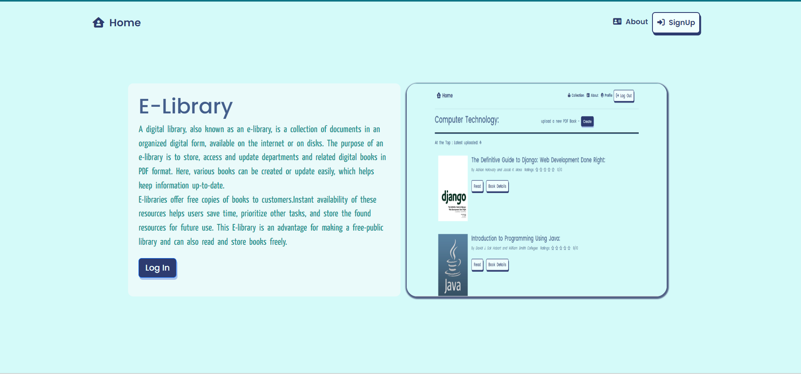
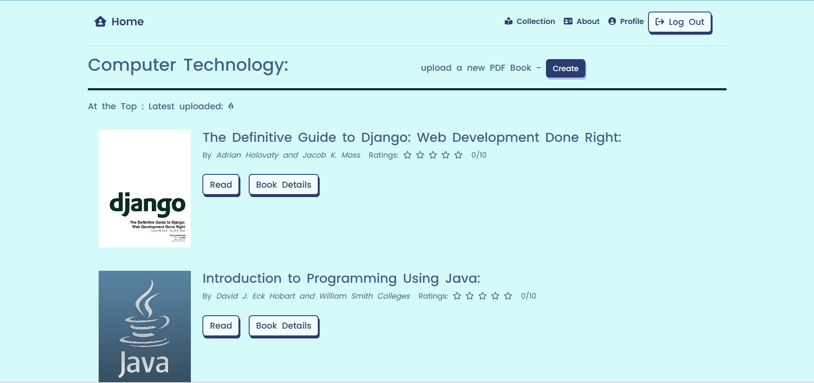

## E-Library App
An E-library app, is a collection of documents in an organized digital form, available on the internet or on disks. The purpose of an e-library is to store, access and update departments and related digital books in PDF format. Here, various books can be created or update easily, which helps keep information up-to-date. Instant availability of these resources helps users save time, prioritize other tasks, and store the found resources for future use. E-library can be use by role as a librarian offers free e-books for making a free-public library or a customer who can read and download e-books freely.

#### Project Name: `Library`
#### Project apps:
- Django app: `backend`
- React app: `frontend`

### Process
The website environment which is meant for public. This contains the user data.
- Git clone `https://github.com/shinegit1/E-Library-app.git`
- Open terminal in project root directory`.\library>`
- Run to create migrations: `py manage.py makemigrations`
- Run to apply the migrations: `py manage.py migrate`
- Run the website by using both server:
    - Terminal 1: Run Django server: `py manage.py runserver`
    - Terminal 2: Change directory for React server: `.\library> cd frontend` and Type `npm start`

This is Django With React based project. It is not deploy in server. If you want to add more features and to design it 
as you desired, it is free to use for the public.

Thank you.
